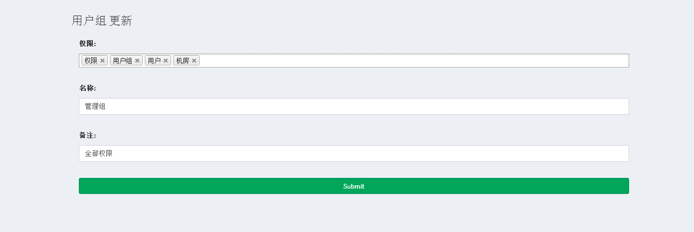
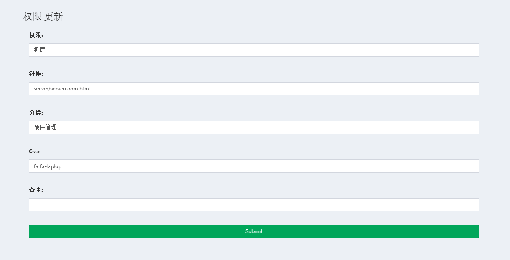

- 这是一个基于django，adminlte2，datatable的管理后台，实现了CURD功能
- 仅需要添加一个model，modelform，再加一条代码，就可以马上实现表格的CURD功能，简单功能强大




---

- 实现的方式类似
 1. python manage.py startapp server
 2. 在model.py 中创建一个model 类 
 
		``` python
		class ServerRoom(models.Model):
		    name = models.CharField(u'机房',max_length=128)
		
		```
 3. 在forms.py 中创建一个基于ServerRoom的ModelForm
 
		```python
		from config.base import curd
		from .forms import *
		
		BASE_URLS = [ ]
		
		BASE_URLS =  BASE_URLS + curd.create_crud(ServerRoom,ServerRoomForm,'serverroom','server/serverroom',u'机房')
		
		def urls():
		    all_urls = BASE_URLS + [  ]
		    return all_urls

		```


 4. 现在可以加入应用到setting.py中
 		```python
		INSTALLED_APPS = [
		    'django.contrib.staticfiles',
		    'home.apps.HomeConfig',
		    'auth',
		    'server',
		]
		```
 
 5. 在urls.py中添加
 	from server import views as server_views
	urlpatterns = urlpatterns + server_views.urls()

 5. python manager.py makemigrations 
 6. python manager.py migrate
 7. 启动项目

 9. 在权限中添加一个项目，链接写 server/serverroom.html,并给用户组添加一个权限
 10.  ok这就完成了